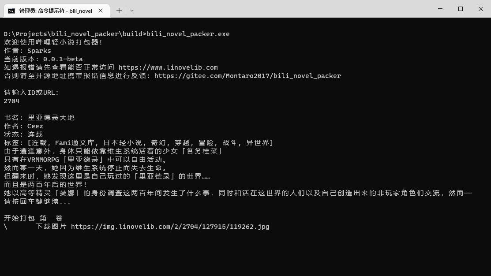
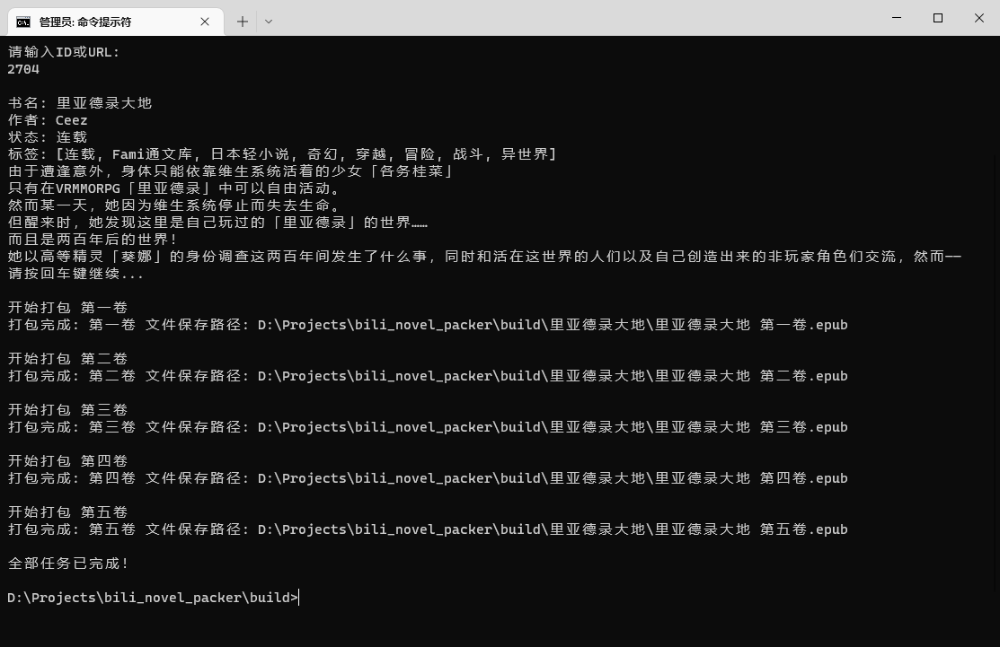

# 哔哩轻小说打包器

## 介绍

本项目用于从[哔哩轻小说](https://www.linovelib.com)网站下载小说并打包成EPUB

输入URL或ID即可自动下载并打包成EPUB格式，支持封面、插图以及目录！

## 下载

[点此下载](https://gitee.com/Montaro2017/bili_novel_packer/releases)

## 使用
双击exe或者使用命令提示符都可。





## 编译

由于Dart暂不支持交叉编译，因此仅提供windows版本的编译产物，如需在其他系统上使用，请自行下载编译。

### windows
执行目录下的[**compile.bat**](./compile.bat)即可。

或者执行
```
dart compile exe bin/main.dart -o ./build/bili_novel_packer.exe
```

### 其他系统
同windows，修改打包后的文件名即可
```
dart compile exe bin/main.dart -o ./build/bili_novel_packer
```