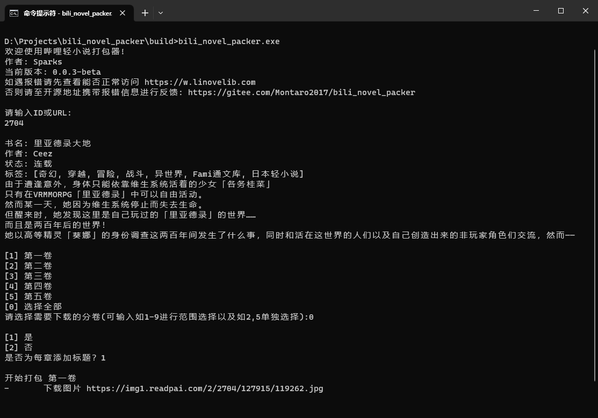
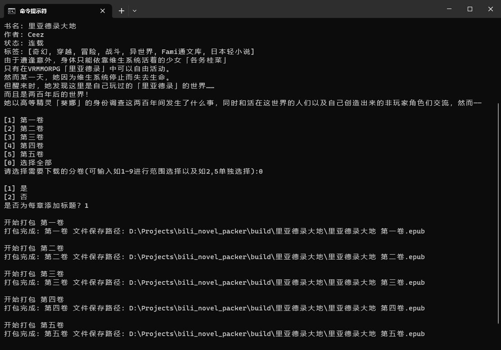
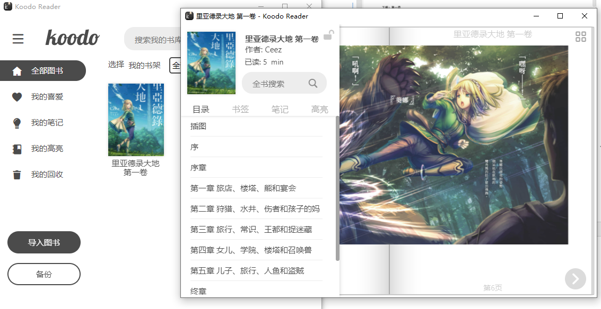

<h1 align="center">轻小说打包器</h1>

<p align="center">
    
    
    <a href='https://gitee.com/Montaro2017/bili_novel_packer/'></img></a>
    <a target="_blank" href='https://github.com/Montaro2017/bili_novel_packer'>
		
	</a>
</p>

<p align="center">
    <a href="https://gitee.com/Montaro2017/bili_novel_packer">Gitee</a> / <a href="https://github.com/Montaro2017/bili_novel_packer">GitHub</a>
</p>

<hr/>

## 介绍

轻小说打包器，可以将支持的轻小说网站中的小说打包成EPUB格式，包含插图和目录。

### 目前支持的轻小说网站
 - [哔哩轻小说](https://www.linovelib.com)
 - [轻小说文库](https://www.wenku8.net/login.php)

## 下载

[国内Gitee](https://gitee.com/Montaro2017/bili_novel_packer/releases) / [国外GitHub](https://github.com/Montaro2017/bili_novel_packer/releases)

## 使用
双击exe或者使用命令提示符都可。






### 多看阅读

**多看阅读插图支持交互模式，点击可全屏查看**


### Koodo Reader



## 常见问题

### 为什么经常使用不了

网站会更新反爬策略，需要更新后才能使用，使用时请确保使用的是最新版，如果最新版也无法使用，请反馈Issues。

### 为什么打包速度这么慢

网站有RateLimit速度限制，请求速度过快会被限制访问。

### 如何修改封面图片

1. 以ZIP方式解压EPUB文件
2. 编辑`OEBPS/content.opf`文件

如果`OEBPS/images`文件夹内没有封面图片

1. 添加图片到`images`目录下
2. 在`OEBPS/content.opf`文件的`manifest`中添加一行`<item id="images\000001.jpg" href="images/000001.jpg" media-type="image/jpeg"/>`
3. 将上面的`000001.jpg`改成对应图片的名称，不要修改斜杠和反斜杠

修改封面

1. 找到`<item id="cover-image" href="images/000035.jpg" media-type="image/jpeg"/>`这一行
2. 将href的值改成图片的路径
3. 压缩成ZIP，修改后缀为EPUB

## 编译

由于Dart暂不支持交叉编译，因此仅提供windows版本的编译产物，如需在其他系统上使用，请自行下载编译。

### windows
执行目录下的[**compile.bat**](./compile.bat)即可。

或者执行
```
dart compile exe bin/main.dart -o ./build/bili_novel_packer.exe
```

### 其他系统
同windows，修改打包后的文件名即可
```
dart compile exe bin/main.dart -o ./build/bili_novel_packer
```